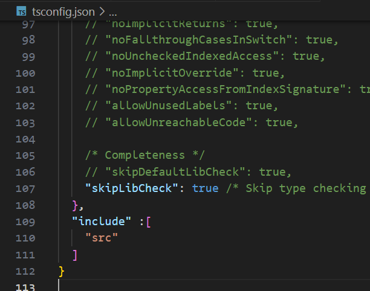

# Typescript : Getting Started

### Getting Started
`npm i -g typescript` = globally install typescript

`tsc` = compiler for TS, converts TS to JS

`tsc filename` = JS file genrated (compilation done)

create html file , add that js file in html and check browser

`tsc filename -w` = continously watches TS

### Folder Strucure for TS
- INSIDE TS folder , run `tsc -init` to get ts config file
- This will create a tsconfig.json file with some settings
- Specifies the root files/directories to compile
- CLTR + F =  rootDir : './src' and outDir : './dist' where we will get all compiled js file and that file to html
- src : contains all the .ts files 
- build or dist : contain html and compled JS files
- to prevent changes from files outside src folder , add include in tsconfig file

- if i add a number to a string , ts compiler will highlight it with red underline, but still compile and run the JS file despite of it being wrong
- to avoid this , uncomment line 71 of tsconfig file = "noEmitOnError": true,   

The terms "strongly typed" and "weakly typed" refer to how a programming language handles the conversion and interaction of data types. Let's explore these concepts with examples in both JavaScript (a weakly typed language) and TypeScript (a strongly typed superset of JavaScript).

### TypeScript Basic Types:

1. **Number:**
   - Represents numeric values (integer or floating-point).
   - Example:

   ```typescript
   let age: number = 25;
   let price: number = 10.99;
   ```

2. **String:**
   - Represents text or character sequences.
   - Example:

   ```typescript
   let name: string = "John";
   let message: string = `Hello, ${name}!`;
   ```

3. **Boolean:**
   - Represents true or false values.
   - Example:

   ```typescript
   let isStudent: boolean = true;
   let hasCar: boolean = false;
   ```

4. **Any:**
   - Represents a type where you can assign values of any data type.
   - It provides flexibility but loses some of TypeScript's benefits.
   - Example:

   ```typescript
   let dynamicValue: any = 42;
   dynamicValue = "Hello";
   dynamicValue = true;
   ```

### Union Types in TypeScript:

Union types allow a variable to have multiple types. It is denoted by using the `|` (pipe) symbol between types.

Example:

```typescript
// Union type for a variable that can be either a number or a string
let value: number | string;
value = 10;       // Valid
value = "Hello";  // Valid
// value = true;   // Error: Type 'boolean' is not assignable to type 'number | string'.
```

In this example, the `value` variable can be assigned a value of either type `number` or `string`, but not any other type.

You can also use union types with other TypeScript features, such as function parameters or return types:

```typescript
// Function with a parameter of union type
function display(value: number | string): void {
    console.log(value);
}

// Function with a union type return type
function getRandomValue(): number | string {
    return Math.random() < 0.5 ? 42 : "Hello";
}
```

In these examples, the `display` function can accept either a number or a string, and the `getRandomValue` function can return either a number or a string.

Union types enhance the flexibility and expressiveness of TypeScript by allowing you to work with variables that can have multiple types.

### Strongly Typed:

**Strongly typed** languages enforce strict type rules and do not implicitly convert between different data types. Type safety is a key characteristic, and the compiler or interpreter strictly checks for type compatibility.

**TypeScript Example (Strongly Typed):**
```typescript
// TypeScript (strongly typed)
let num1: number = 5;
let num2: number = "10"; // Error: Type 'string' is not assignable to type 'number'.
let sum: number = num1 + num2; // Error: Operator '+' cannot be applied to types 'number' and 'string'.
```

In this TypeScript example, the compiler throws errors when attempting to assign a string to a number variable (`num2`) or when trying to add a number and a string (`num1 + num2`). TypeScript enforces strict type checking.

### Weakly Typed:

**Weakly typed** languages are more permissive with type conversions, often allowing implicit type coercion. In weakly typed languages, the interpreter or compiler may automatically convert data between different types during operations.

**JavaScript Example (Weakly Typed):**
```javascript
// JavaScript (weakly typed)
let num1 = 5;
let num2 = "10"; // No error, implicit conversion from string to number.
let sum = num1 + num2; // The result is "510" due to implicit conversion.
```

In this JavaScript example, there are no explicit type declarations, and the interpreter implicitly converts the string `"10"` to a number during the addition operation. This implicit conversion can lead to unexpected behavior, and it's an example of weak typing.

### Comparison:

- **Strongly Typed (TypeScript):**
  - Advantages:
    - Early error detection.
    - Improved code robustness.
    - Enhanced tooling support.
  - Disadvantages:
    - Requires more explicit type declarations.

- **Weakly Typed (JavaScript):**
  - Advantages:
    - Flexibility and simplicity.
    - Shorter code due to implicit conversions.
  - Disadvantages:
    - Potential for unexpected behavior.
    - May lead to runtime errors that could be challenging to debug.

There are several advantages of using strongly typed languages like TypeScript:

1. **Code documentation**: By explicitly specifying types, the code becomes self-documented. It becomes easier for developers (including yourself) to understand the purpose and usage of variables, functions, and parameters.

2. **Early error detection**: Strongly typed languages perform type checking during development. This means that the compiler can catch potential type-related errors before the code is executed. It helps in identifying issues that might lead to bugs or unexpected behavior.

3. **Improved code quality**: By enforcing type safety, strongly typed languages help maintain code quality. Type errors and inconsistencies can be reduced, leading to more reliable and robust software.

4. **Enhanced tooling support**: Strongly typed languages often have better support from development tools, such as IDEs and code editors. Tools like auto-completion, intelligent suggestions, and refactoring assistance can make development faster and more efficient.

5. **Team collaboration**: Strong typing can facilitate team collaboration by making code more understandable and predictable. It helps in reducing confusion and misinterpretation of data types, leading to smoother collaboration among team members.


