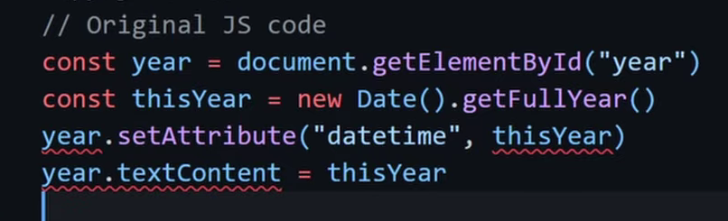
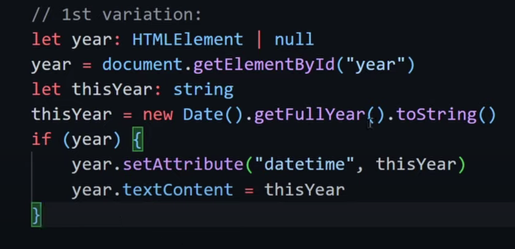

### 1. **Type Assertions in TypeScript:**
   - **Theory:**
     - Type assertions in TypeScript are used to inform the compiler about the specific type of a value when it cannot be accurately inferred.
     - They are commonly employed when working with external libraries or in situations where the compiler might struggle to determine the type.
   - **Code Examples:**
     ```typescript
     type One = string
     type Two = string | number
     type Three = 'hello'

     let a: One = 'hello';
     let b = a as Two;   // Less specific type assertion
     let c = a as Three; // More specific type assertion

     let d = <One>'world';                    // Using angle brackets
     let e = <string | number>'world';        // Using angle brackets

     const addorConcat = (a: number, b: number, c: 'add' | 'concat'): number | string => {...}

     let myVal: string = addorConcat(2, 2, 'concat') as string; // Type assertion for narrowing
     ```

### 2. **Double/Forced Casting:**
   - **Theory:**
     - Double casting, or forced casting, involves performing two type assertions consecutively.
     - This can be done using the `as` keyword or angle bracket syntax.
   - **Code Example:**
     ```typescript
     // Double casting using 'as'
     (10 as unknown) as string;
     ```

### 3. **Unknown vs Any:**
   - **Theory:**
     - The `unknown` type represents values that are not yet known, similar to `any`, but with additional type checking.
     - Unlike `any`, you cannot access properties or call methods on a variable of type `unknown` without explicit type assertion or type narrowing.
   - **Code Example:**
     ```typescript
     // Using unknown
     let value: unknown;
     value.length;  // Error - Property 'length' does not exist on type 'unknown'.
     ```

### 4. **Non-Null Assertions:**
   - **Theory:**
     - Non-null assertions (`!`) are used to inform TypeScript that a value is non-null, eliminating null or undefined from the type.
     - They should be used cautiously, as improper usage can lead to runtime errors.
   - **Code Example:**
     ```typescript
     const img = document.querySelector('img')!; // Non-null assertion
     img.src;  // No warning about potential null or undefined
     ```

### 5. **HTML Types and The DOM:**
   - **Theory:**
     - TypeScript has built-in HTML types for working with the Document Object Model (DOM).
     - Non-null assertions and HTML types cannot be used simultaneously in TypeScript.
   - **Code Example:**
     ```typescript
     const img = document.querySelector('img')!;             // Infers HTMLImageElement
     const myImg = document.getElementById('#img') as HTMLImageElement; // Infers HtmlElement
     img.src; // No warning about potential null or undefined
     ```

### 6. **Warnings and Caveats:**
   - **Theory:**
     - Improper use of type assertions can lead to runtime errors or unexpected behavior.
     - TS provides warnings when it identifies potentially unsafe type assertions.
   - **Code Examples:**
     ```typescript
     let myVal3: number = addorConcat(2, 3, 'concat') as number; // No warning, but may result in unexpected behavior at runtime
     ```

### Conclusion:
The provided TypeScript code introduces the concept of type assertions, covering various scenarios such as type narrowing, double casting, and their applications in dealing with the DOM. It also highlights the differences between `unknown` and `any` types, and the caution required when using non-null assertions.

### challenge - 

First variation - 

Actual optimal way using type assertions - 
```ts
const year = document.getElementById('year') as HTMLSpanElement;
const thisYear:string = new Date().getFullYear().toString();
year.setAttribute("datetime",thisYear)
year.textContent = thisYear;
```